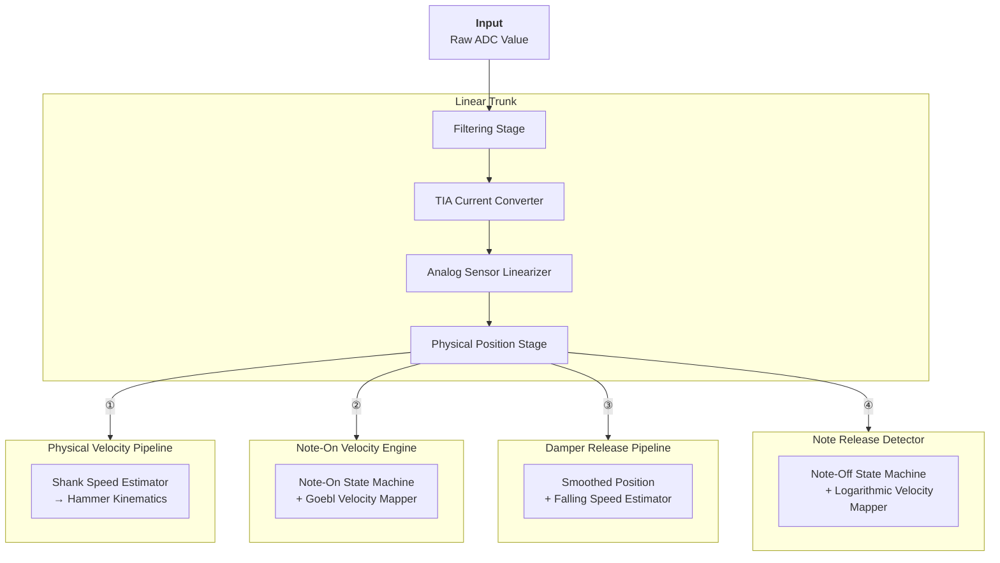

# Theory of Operation: Signal Processing Workflow

**Responsibility:** Transform a raw 16-bit ADC value into calibrated physical measurements and key action events (`OnNoteOn` / `OnNoteOff`) with perceptually accurate velocity, in real time.

---

## Introduction

The `SignalProcessingWorkflow` is the top-level DSP pipeline executed for each of the 22 sensor channels at every acquisition tick. Running at 18,000 Hz on a STM32H743 (ARM Cortex-M7), it must produce low-latency, noise-robust results under strict real-time constraints.

The pipeline takes a single raw ADC sample as input and produces, as side effects, a set of continuously updated physical measurements and — when the appropriate conditions are met — key action events (`OnNoteOn` / `OnNoteOff`) with calibrated velocities, emitted via the `KeyActionRequirements` interface.

---

## 1. Architecture Overview

The workflow is composed of a shared preprocessing chain followed by four independent branches, all executed sequentially within the same tick in a defined order.

---

## 2. Stages

The first four stages form the shared preprocessing chain, whose output — the normalized shank position — is the common input to the four subsequent branches. Two dependency relationships exist between the branches: the Note-On engine consumes the hammer speed produced by the Physical Velocity Pipeline, and the Note Release Detector consumes the falling speed produced by the Damper Release Pipeline.

### 2.1 Filtering Stage

The raw ADC output carries quantization noise and high-frequency interference. A **Simple Moving Average** is applied as a first-pass filter to stabilize the signal before conversion. This stage can be disabled at compile time (`SIGNAL_FILTERING_ENABLED`) for diagnostic purposes, in which case it is replaced by an identity filter.

### 2.2 TIA Current Converter

The filtered ADC value is converted into a sensor current in mA. This step corrects for the inverting topology of the transimpedance amplifier and abstracts away the hardware parameters ($V_{REF}$, $R_f$, ADC resolution), producing a physically meaningful quantity independent of circuit-level details.

*See: [TIA Current Converter](stages/tia-current-converter.md)*

### 2.3 Analog Sensor Linearizer

The current in mA is mapped to a **normalized shank position** in the range $[0.0,\ 1.0]$ using a per-sensor lookup table (LUT) generated at boot time. This step corrects for the non-linear optical response of the CNY70 and compensates for gain dispersion between individual sensors.

*See: [CNY70 Linearization](stages/cny70-linearization.md)*

### 2.4 Physical Position Stage

The normalized position is scaled to a physical distance in millimeters ($mm$), using the mechanical travel $\Delta d$ of the shank at the sensor location. This sets the strike point as the zero reference, giving all subsequent calculations an intuitive physical meaning.

*See: [Physical Position Stage](stages/physical-position-stage.md)*

### 2.5 Physical Velocity Pipeline

Estimates the instantaneous speed of the hammer head in $m/s$ from the shank position. The pipeline differentiates the physical position using a **Sliding Linear Regression** (OLS), smooths the result with a **Simple Moving Average**, and applies the shank-to-hammer leverage ratio $L_{ratio}$ to obtain the final hammer head velocity.

Speed estimation is gated to the active zone (above `HAMMER_POSITION_DAMPER`) to avoid unnecessary computation and spurious readings while the hammer is at rest.

*See: [Shank Speed Estimation](stages/hammer-shank-speed.md), [Shank-to-Hammer Kinematics](stages/shank-to-hammer-kinematic-stage.md)*

### 2.6 Note-On Velocity Engine

Implements the Note-On state machine. It monitors the hammer speed produced by the Physical Velocity Pipeline, latches the velocity at the **escapement point** (the moment of free flight), and calls `OnNoteOn(velocity)` via the `KeyActionRequirements` interface if the hammer subsequently reaches the **strike point**. Velocity is mapped using the **Goebl logarithmic model**.

The Note-On pipeline operates under a strict latency budget: the hammer speed must be captured within the few milliseconds between the escapement point and string contact.

*See: [Note-On Velocity Engine](stages/noteon-velocity-engine.md)*

### 2.7 Damper Release Pipeline

Estimates the falling speed of the shank during key release, for use by the Note Release Detector. Unlike the Note-On pipeline, the Note-Off path operates under **relaxed latency constraints** — a few milliseconds of additional delay on a key release is imperceptible to the player. This allows the use of heavier filtering for better noise immunity, at the cost of some amplitude attenuation which is compensated by a fixed scale factor.

The pipeline uses a heavily smoothed position signal (large-window SMA) to drive a **Central Difference** differentiator. Speed estimation is gated to the active zone and conditioned on an active Note-On, avoiding computation during idle periods.

| | Note-On (2.5 & 2.6) | Note-Off (2.7 & 2.8) |
| :--- | :--- | :--- |
| **Latency budget** | < 1 ms (escapement window) | Relaxed (several ms tolerated) |
| **Differentiator** | Sliding Linear Regression (OLS) | Central Difference |
| **Smoothing** | Moderate SMA | Heavy SMA + scale correction |
| **Rationale** | Must capture velocity before free flight | Player cannot perceive small Note-Off delays |

*See: [Release Velocity & Note-Off Engine](stages/release-velocity.md)*

### 2.8 Note Release Detector

Implements the Note-Off state machine. It continuously latches the falling speed produced by the Damper Release Pipeline while the key is held, and calls `OnNoteOff(release_velocity)` via the `KeyActionRequirements` interface when the smoothed shank position crosses the `HAMMER_POSITION_DAMPER` threshold on its way back to rest. Velocity is mapped using a **logarithmic curve** tuned for the perception of damping.

*See: [Release Velocity & Note-Off Engine](stages/release-velocity.md)*
