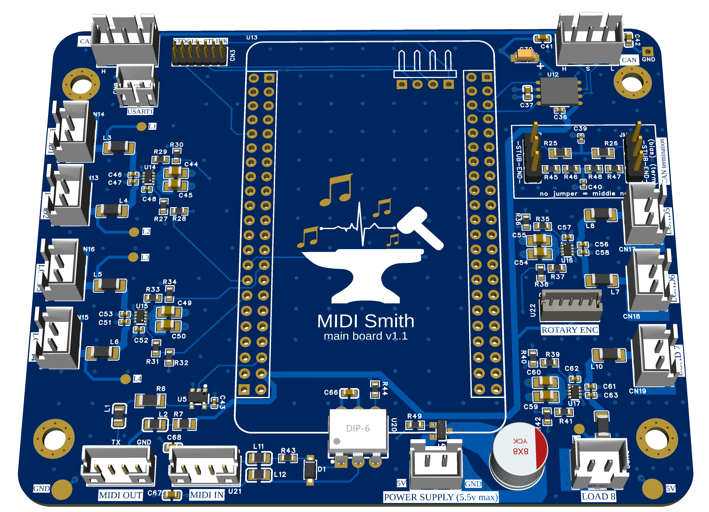

# Main Board Hardware Overview

## 1. Overview

### Role in the System
The **main-board** is the central control board of the system.

Its main responsibilities are:
- Distribute power to the ADC boards.
- Orchestrate the ADC boards over the CAN bus.
- Receive sensor events from the ADC boards and generate MIDI messages.
- Store the mapping between piano keys and ADC sensors.
- Store the ADC sensor calibration data.

### Hardware Summary
At a high level, the main-board provides:
- CAN connectivity for communication with the ADC boards.
- USB MIDI connectivity through the USB port on the core board.
- DIN MIDI input and output through dedicated carrier board connectors.
- Persistent storage for configuration and calibration data.
- Debug access through an STDC14 connector.
- Switched 5V outputs for powering external boards or peripherals.
- A local display and status LED for diagnostics.

---

## 2. Board Architecture

### Two-Board Assembly
The main-board is built from two hardware parts:
- A **WeAct H743 core board** containing the MCU and several onboard peripherals.
- A **carrier board** adding the project-specific connectors, transceivers, power switching,
  and debug access.

### Core Board
The core board provides:
- ARM Cortex-M7 MCU (`STM32H743VIT6`), up to `480 MHz`.
- Embedded memory: `2048 Kbytes` Flash and `1 MB` RAM.
- On-board USB connector.
- Integrated TFT display.
- External storage (`8 MB` SPI flash, `8 MB` QSPI flash, MicroSD).
- User LED.

### Carrier Board
The carrier board provides:
- CAN transceiver and CAN connectors.
- MIDI IN / MIDI OUT connectors.
- Auxiliary serial connector (`USART1`).
- STDC14 debug connector.
- External power input.
- Switched 5V outputs controlled by GPIOs.
- Rotary encoder connector.

### Internal Interconnect
The core board connects to the carrier board through:
- Two `2x22` headers.
- Four dedicated debug-related pins.

---

## 3. Hardware Features

### CAN
- **Role:** communication with the ADC boards.
- **Board Side:** carrier board.
- **Physical Interface:** two CAN daisy-chain connectors through the CAN transceiver.
- **Connector Type:** XH 3-pin.
- **Connector References:** `CN6`, `CN7`.
- **Carrier Board Hardware:** NXP `TJA1042T/3/1J` transceiver.
- **MCU Peripheral:** `FDCAN1`.

| Signal | MCU Pin | STM32 Function | Notes |
| :--- | :--- | :--- | :--- |
| `FDCAN_RX` | `PB8` | `FDCAN1_RX` | Receive from the CAN transceiver |
| `FDCAN_TX` | `PB9` | `FDCAN1_TX` | Transmit to the CAN transceiver |
| `FDCAN_STANDBY` | `PB5` | `GPIO_Output` | `Low` = normal mode, `High` = standby |

**Notes**
- CAN termination is configured with two jumper headers on the carrier board.
- Jumper positions: `STUB` = bias, `END` = termination, no jumper = middle node.

**Connector Pinout**
| Pin | Description |
| :--- | :--- |
| `1` | `CAN_H` |
| `2` | `Shield` |
| `3` | `CAN_L` |

### USB MIDI
- **Role:** USB MIDI connection to a host computer.
- **Board Side:** core board.
- **Physical Interface:** on-board USB connector.
- **MCU Peripheral:** `USB_OTG_HS` in `Device_Only_FS` mode.

| Signal | MCU Pin | STM32 Function | Notes |
| :--- | :--- | :--- | :--- |
| `USB_DM` | `PA11` | `USB_OTG_FS_DM` | USB data - |
| `USB_DP` | `PA12` | `USB_OTG_FS_DP` | USB data + |

### MIDI IN / MIDI OUT
- **Role:** external MIDI input and output.
- **Board Side:** carrier board.
- **Physical Interface:** PH 4-pin connectors.
- **Connector Type:** PH 4-pin.
- **Connector References:** `U18` (`MIDI OUT`), `U21` (`MIDI IN`).
- **MCU Peripheral:** `USART3`.

| Signal | MCU Pin | STM32 Function | Notes |
| :--- | :--- | :--- | :--- |
| `MIDI_OUT` | `PB10` | `USART3_TX` | Hardware MIDI output |
| `MIDI_IN` | `PB11` | `USART3_RX` | Hardware MIDI input |

**Connector Pinout**
| Pin | Description |
| :--- | :--- |
| `MIDI IN - 1` | `Shield` |
| `MIDI IN - 2` | `MIDI DIN 5` |
| `MIDI IN - 3` | `MIDI DIN 4` |
| `MIDI IN - 4` | `MIDI DIN 2` |
| `MIDI OUT - 1` | `MIDI DIN 2 (GND)` |
| `MIDI OUT - 2` | `MIDI DIN 4` |
| `MIDI OUT - 3` | `MIDI DIN 5 (TX)` |
| `MIDI OUT - 4` | `Shield (GND)` |

### Debug Interface
- **Role:** programming, SWD debugging, and serial console access.
- **Board Side:** carrier board.
- **Physical Interface:** `STDC14`.
- **Connector Type:** STDC14.
- **Connector Reference:** `CN3`.
- **MCU Peripheral:** SWD + `USART2`.

| Signal | MCU Pin | STM32 Function | Notes |
| :--- | :--- | :--- | :--- |
| `SWDIO` | `PA13` | `DEBUG_JTMS-SWDIO` | SWD data |
| `SWCLK` | `PA14` | `DEBUG_JTCK-SWCLK` | SWD clock |
| `DEBUG_UART_TX` | `PA2` | `USART2_TX` | Console transmit on the STDC14 connector |
| `DEBUG_UART_RX` | `PA3` | `USART2_RX` | Console receive on the STDC14 connector |

**Notes**
- This interface supports **SWD debug** and a **USART2 console**.
- JTAG is not used on this board.

**Connector Pinout**
| Pin | Description |
| :--- | :--- |
| `1` | `N/C` |
| `2` | `N/C` |
| `3` | `+3.3V` |
| `4` | `SWDIO` |
| `5` | `GND` |
| `6` | `SWCLK` |
| `7` | `GND` |
| `8` | `N/C` |
| `9` | `SWCLK` |
| `10` | `N/C` |
| `11` | `N/C` |
| `12` | `NRST` |
| `13` | `USART2_RX` |
| `14` | `USART2_TX` |

### Auxiliary Serial expansion (Not used yet)
- **Role:** auxiliary serial expansion.
- **Board Side:** carrier board.
- **Physical Interface:** PH 2-pin connector.
- **Connector Type:** PH 2-pin.
- **Connector Reference:** `CN9`.
- **MCU Peripheral:** `USART1`.

| Signal | MCU Pin | STM32 Function | Notes |
| :--- | :--- | :--- | :--- |
| `USART1_TX` | `PA9` | `USART1_TX` | Auxiliary serial transmit |
| `USART1_RX` | `PA10` | `USART1_RX` | Auxiliary serial receive |

**Connector Pinout**
| Pin | Description |
| :--- | :--- |
| `1` | `TX` |
| `2` | `RX` |

**TODO:** document the intended external usage and voltage expectations.

### External Power Input
- **Role:** power entry for the board assembly.
- **Board Side:** carrier board.
- **Physical Interface:** dedicated external power connector.
- **Connector Type:** XH 2-pin.
- **Connector Reference:** `CN21`.

**Connector Pinout**
| Pin | Description |
| :--- | :--- |
| `1` | `+5V` |
| `2` | `GND` |

**Notes**
- Maximum input voltage: `+5.5V`.
- Reverse polarity protection is implemented with a P-channel MOSFET.
- There is no fuse on the input.
- The incoming `+5V` rail feeds both the MCU/core board supply path and the switched 5V load
  outputs.

### Switched 5V Outputs
- **Role:** distribute switched 5V power to external boards or peripherals.
- **Board Side:** carrier board.
- **Physical Interface:** eight output connectors.
- **Connector References:** `CN14`, `CN13`, `CN16`, `CN15`, `CN17`, `CN18`, `CN19`, and
  the connector labeled `LOAD8`.
- **MCU Peripheral:** GPIO.

| Signal | MCU Pin | STM32 Function | Notes |
| :--- | :--- | :--- | :--- |
| `LOAD_1` | `PE8` | `GPIO_Output` | Switched 5V output control |
| `LOAD_2` | `PE7` | `GPIO_Output` | Switched 5V output control |
| `LOAD_3` | `PB0` | `GPIO_Output` | Switched 5V output control |
| `LOAD_4` | `PE9` | `GPIO_Output` | Switched 5V output control |
| `LOAD_5` | `PB1` | `GPIO_Output` | Switched 5V output control |
| `LOAD_6` | `PB12` | `GPIO_Output` | Switched 5V output control |
| `LOAD_7` | `PB13` | `GPIO_Output` | Switched 5V output control |
| `LOAD_8` | `PB14` | `GPIO_Output` | Switched 5V output control |

**Connector Pinout**
| Pin | Description |
| :--- | :--- |
| `1` | `+5V` |
| `2` | `GND` |

### Rotary Encoder
- **Role:** local user input.
- **Board Side:** carrier board.
- **Physical Interface:** ZH 5-pin connector.
- **Connector Type:** ZH 5-pin.
- **Connector Reference:** `CN22`.
- **MCU Peripheral:** `TIM2` + GPIO input.

| Signal | MCU Pin | STM32 Function | Notes |
| :--- | :--- | :--- | :--- |
| `ROTARY_A` | `PA5` | `TIM2_CH1` | Quadrature channel A |
| `ROTARY_B` | `PA1` | `TIM2_CH2` | Quadrature channel B |
| `ROTARY_BTN` | `PB15` | `GPIO_Input` | Encoder push button |

**Connector Pinout**
| Pin | Description |
| :--- | :--- |
| `1` | `TIM2_CH1` |
| `2` | `TIM2_CH2` |
| `3` | `SWITCH` |
| `4` | `+3.3V` |
| `5` | `GND` |

**Notes**
- The rotary encoder inputs are connected directly to the MCU.
- There is no external pull-up, pull-down, or RC filtering on these signals.

### TFT Display
- **Board Side:** core board.
- **Role:** local diagnostics and debug display.
- **Physical Interface:** integrated TFT display.
- **MCU Peripheral:** `SPI4`.

| Signal | MCU Pin | STM32 Function | Notes |
| :--- | :--- | :--- | :--- |
| `LCD_SCL` | `PE12` | `SPI4_SCK` | Display clock |
| `LCD_SDA` | `PE14` | `SPI4_MOSI` | Display data |
| `LCD_WR_RS` | `PE13` | `GPIO_Output` | Data / command select |
| `LCD_CS` | `PE11` | `GPIO_Output` | Display chip select |
| `LCD_LED` | `PE10` | `GPIO_Output` | Backlight on/off control |
| `LCD_RESET` | `NRST` | `Reset` | Shared with MCU reset |

**Notes**
- The display is integrated on the core board.

### User LED
- **Board Side:** core board.
- **Role:** on-board status LED.
- **MCU Peripheral:** GPIO.

| Signal | MCU Pin | STM32 Function | Notes |
| :--- | :--- | :--- | :--- |
| `USER_LED` | `PE3` | `GPIO_Output` | Active high |

### SPI Flash
- **Board Side:** core board.
- **Role:** persistent application storage.
- **MCU Peripheral:** `SPI1`.

| Signal / Device | MCU Pin | STM32 Function | Notes |
| :--- | :--- | :--- | :--- |
| `SPI1_SCK` | `PB3` | `SPI1_SCK` | `U8` SPI flash clock |
| `SPI1_MISO` | `PB4` | `SPI1_MISO` | `U8` SPI flash data out |
| `SPI1_MOSI` | `PD7` | `SPI1_MOSI` | `U8` SPI flash data in |
| `FLASH_CS` | `PD6` | `GPIO_Output` | `U8` chip select |

**Notes**
- `U8` is currently used for persistent application data such as MIDI mapping and ADC
  calibration.

### QSPI Flash
- **Board Side:** core board.
- **Role:** future high-speed external storage.
- **MCU Peripheral:** `QUADSPI`.

| Signal / Device | MCU Pin | STM32 Function | Notes |
| :--- | :--- | :--- | :--- |
| `U7_CLK` | `PB2` | `QUADSPI_CLK` | `U7` QSPI flash clock |
| `U7_NCS` | `PB6` | `QUADSPI_BK1_NCS` | `U7` chip select |
| `U7_IO0` | `PD11` | `QUADSPI_BK1_IO0` | `U7` data line |
| `U7_IO1` | `PD12` | `QUADSPI_BK1_IO1` | `U7` data line |
| `U7_IO2` | `PE2` | `QUADSPI_BK1_IO2` | `U7` data line |
| `U7_IO3` | `PD13` | `QUADSPI_BK1_IO3` | `U7` data line |

**Notes**
- `U7` is available for future high-speed assets / XIP usage.
- Avoid writes to the QSPI memory-mapped storage while the display is active, to preserve
  reliable access to the `0x90000000` memory-mapped region.

### MicroSD
- **Board Side:** core board.
- **Role:** removable external storage.
- **MCU Peripheral:** `SDMMC1`.

| Signal | MCU Pin | STM32 Function | Notes |
| :--- | :--- | :--- | :--- |
| `SD_D0` | `PC8` | `SDMMC1_D0` | Data line |
| `SD_D1` | `PC9` | `SDMMC1_D1` | Data line |
| `SD_D2` | `PC10` | `SDMMC1_D2` | Data line |
| `SD_D3` | `PC11` | `SDMMC1_D3` | Data line |
| `SD_CK` | `PC12` | `SDMMC1_CK` | Clock |
| `SD_CMD` | `PD2` | `SDMMC1_CMD` | Command |
| `SD_SW` | `PD4` | `GPIO_Input` | Card detect switch |

